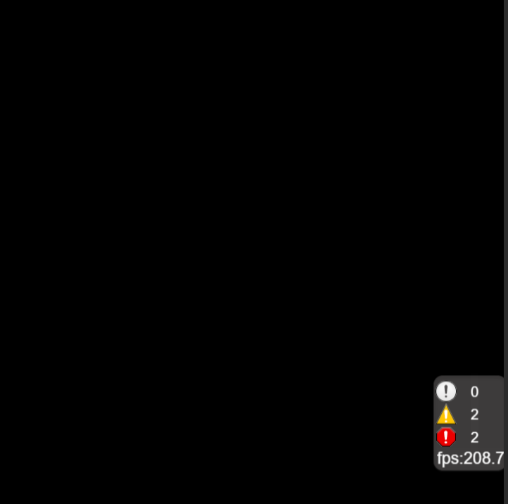
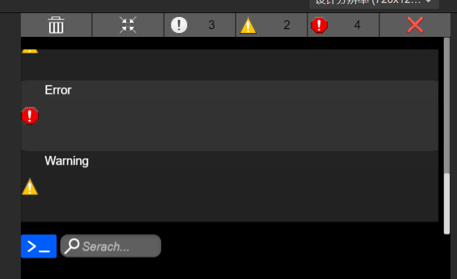
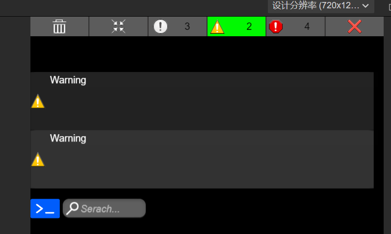
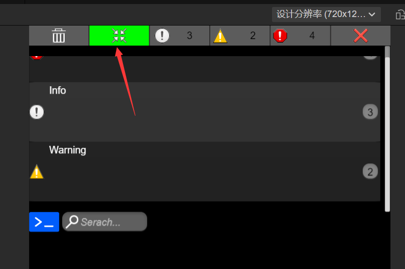
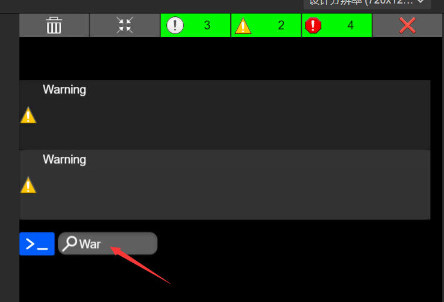
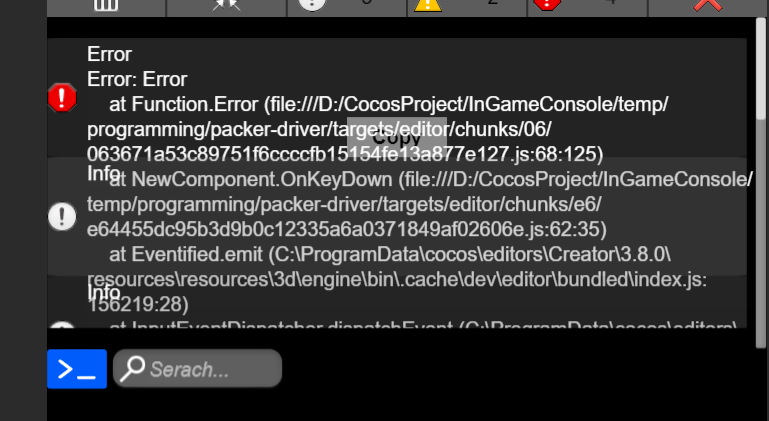
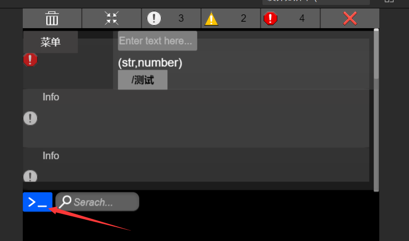
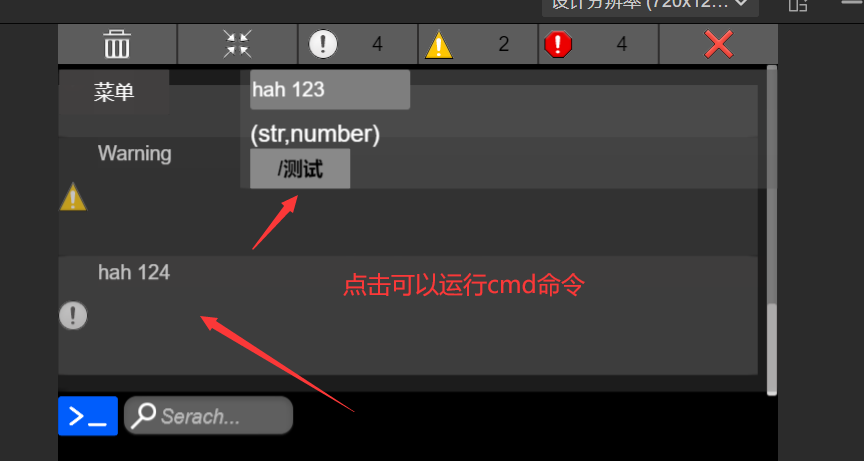

# CocosIngameConsole
参考了Unity的一个debug仓库 https://github.com/yasirkula/UnityIngameDebugConsole

- 外部显示新增加的log和fps信息

- 内部界面

- 过滤

- 合并

- 搜索

- 点击可查看堆栈，且可复制log，界面布局还有点问题

- debug命令，可自己添加

界面还没拼好，功能基本完成
